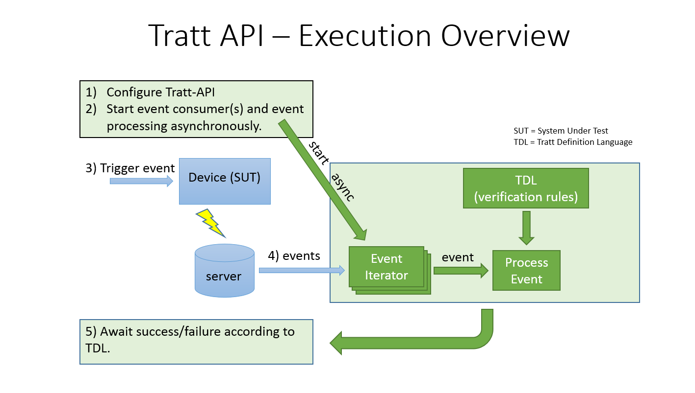

# User Guide
(_this user guide is under construction_)
## Overview

When a user interacts with your system (for example: makes a purchase in your app, or clicks on a button in your webpage etc.) one or several events are logged to some server where your analytic's can analyze it later. We call this log mechanism for tracking.

The tratt-api library helps you verify that your tracking mechanism is working as expected at _end-to-end_ level.

The Tratt Definition Language (TDL) is used to specify sequences of expected events (ie. your verification rules). TDL is in JSON format and _easy-to-understand_. (TDL will be described in detail further below in this User Guide)

### Release notes

## Event structure

## User Defined Services
Tratt-api depends on services provided by the user...

## TDL
## API usage examples
